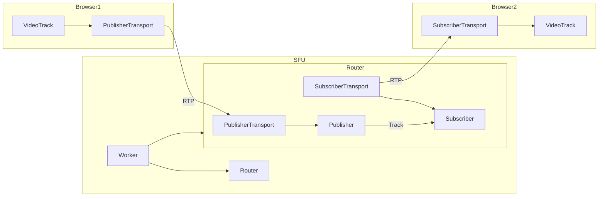

# Rheomesh
[](https://github.com/h3poteto/rheomesh/actions/workflows/e2e.yml)
[](https://github.com/h3poteto/rheomesh/actions/workflows/build.yml)
[](https://crates.io/crates/rheomesh)
[](https://www.npmjs.com/package/rheomesh)
[](https://github.com/h3poteto/rheomesh/releases)
[](LICENSE)

Rheomesh is a WebRTC SFU ([Selective Forwarding Unit](https://bloggeek.me/webrtcglossary/sfu/)) library written by Rust. This provides an SDK to help you build a WebRTC SFU server. And this provides client-side library with TypeScript.

## Features
- [x] Video and Audio streaming
- [x] Data channels
- [x] Simulcast
- [ ] Scalable Video Coding (SVC)
- [x] Relay
- [ ] Recording

## Architecture


## Server-side
Please refer [server-side document](sfu).

## Client-side
Please refer [client-side documents](client).

## Example
### Server side
```
$ cd sfu
$ cargo run --example media_server
```

WebScoket signaling server will launch with `0.0.0.0:4000`.

### Client side
```
$ cd client
$ yarn install
$ yarn workspace media dev
```

You can access the frontend service with `localhost:5173`.

# License
The software is available as open source under the terms of the [Apache License 2.0](https://www.apache.org/licenses/LICENSE-2.0).
