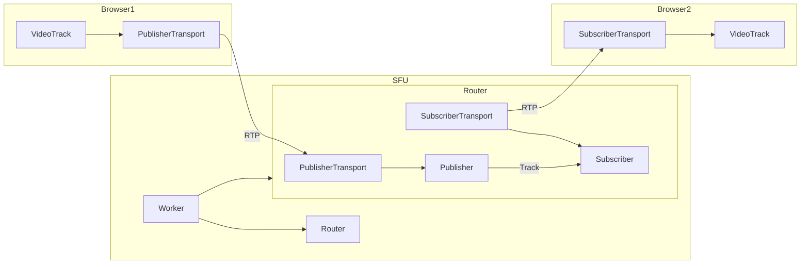

# Rheomesh
[](https://github.com/h3poteto/rheomesh/actions/workflows/e2e.yml)
[](https://github.com/h3poteto/rheomesh/actions/workflows/build.yml)
[](https://crates.io/crates/rheomesh)
[](https://www.npmjs.com/package/rheomesh)
[](https://github.com/h3poteto/rheomesh/releases)
[](LICENSE)

Rheomesh is a WebRTC SFU ([Selective Forwarding Unit](https://bloggeek.me/webrtcglossary/sfu/)) library written by Rust. This provides an SDK to help you build a WebRTC SFU server. And this provides client-side library with TypeScript.

## Features
- [x] Video and Audio streaming
- [x] Data channels
- [x] Simulcast
- [ ] Scalable Video Coding (SVC)
- [x] Relay
- [ ] Recording

## Architecture


## Server-side
Please refer [server-side document](sfu).

## Client-side
Please refer [client-side documents](client).

## Examples
### Data channels
Launch server side.
```
$ cd sfu
$ cargo run --example data_server
```

Launch client side.
```
$ cd client
$ yarn install
$ yarn workspace rheomesh build
$ yarn workspace data dev
```

You can access the frontend service with `localhost:5173`.
Then, click `connect` on browser 1 and browser 2. And click `publish` on the browser 1. Last, type some words in the form, and click `send` button on the browser 1. As a result, you can see the words on the browser 2.

### Camera
Launch server side.
```
$ cd sfu
$ cargo run --example media_server
```

Launch client side.
```
$ cd client
$ yarn install
$ yarn workspace rheomesh build
$ yarn workspace camera dev
```

You can access the frontend service with `localhost:3000`, and please join an arbitrary room, e.g. `my-room`.
Then, click `connect` and `camera` on browser 1. Next, click `connect` on browser 2. As a result, you can see the camera video on the browser 2.

### Screen shareing
Launch server side.
```
$ cd sfu
$ cargo run --example media_server
```

Launch client side.
```
$ cd client
$ yarn install
$ yarn workspace rheomesh build
$ yarn workspace multiple dev
```

You can access the frontend service with `localhost:3000`, and please join an arbitrary room, e.g. `my-room`.

### Relay with two servers
To use relay feature you need two or more servers. In this section, we are using docker command to simulate two servers.
**Note**: Please update `PUBLIC_IP` environment variable in `compose.yaml` file.

```
$ docker compose up -d
```

When you access `localhost:3001`, the frontend connects server 1 (`sfu1`). When you access `localhost:3002`, the frontend connects server 2 (`sfu2`). Please try:

1. Join the same room, e.g. `my-room` on `localhost:3001` and `localhost:3002`
1. `Connect` on `localhost:3001`
1. `Capture` a screen on `localhost:3001`
1. `Connect` on `localhost:3002`
1. You can see the screen on `localhost:3002`


# License
The software is available as open source under the terms of the [Apache License 2.0](https://www.apache.org/licenses/LICENSE-2.0).
