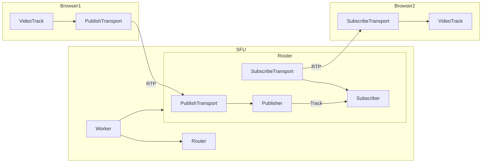

# Rheomesh Architecture

Rheomesh is a Selective Forwarding Unit (SFU) implementation that provides efficient real-time media streaming capabilities. This document outlines the core architectural components and data flow within the system.

## Overview

Rheomesh follows a typical SFU architecture pattern where the server acts as a central media router that selectively forwards media streams between connected clients without transcoding the media content.

## Core Components

### SFU Server
The SFU server is the central component that handles all media routing operations:

- **Worker**: The top-level container that manages system resources. Create one Worker per server process.
- **Router**: A media routing unit that handles multiple transports. Think of it as a “meeting room” where participants can exchange media. Multiple routers can be created to distribute load across different media sessions
- **Transport**: Individual connections for publishing or subscribing to media streams.

### Transport Layer
The transport layer manages WebRTC connections between clients and the server:

- **PublishTransport**: Handles incoming media streams from clients who are publishing content (e.g., camera, microphone)
- **SubscribeTransport**: Manages outgoing media streams to clients who are consuming content
- **RecordingTransport**: Manages raw RTP transporting for recording.

### Media Handling
- **Publisher**: Represents a media producer that receives and processes incoming media tracks from clients
- **Subscriber**: Represents a media consumer that sends media tracks to subscribing clients
- **LocalTrack/RecordingTrack/RelayedTrack**: Individual media streams (video or audio) that flow between clients

## Data Flow

The media streaming process follows this sequence:

1. **Publishing Phase**:
   - Browser1 creates a VideoTrack and establishes a PublishTransport connection
   - The media is sent via RTP protocol to the SFU's PublishTransport
   - The Publisher component processes and makes the track available for distribution

2. **Routing Phase**:
   - The Router manages track distribution between Publishers and Subscribers

3. **Subscription Phase**:
   - Browser2 establishes a SubscribeTransport connection
   - The Subscriber component receives the track from the Publisher
   - Media is forwarded via RTP to the subscribing client's VideoTrack

## Architecture Diagram

