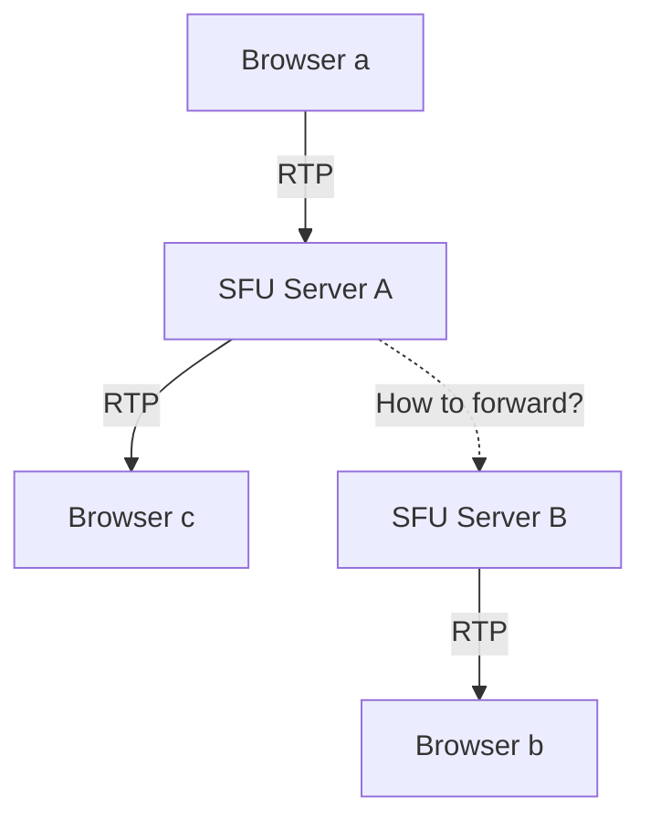
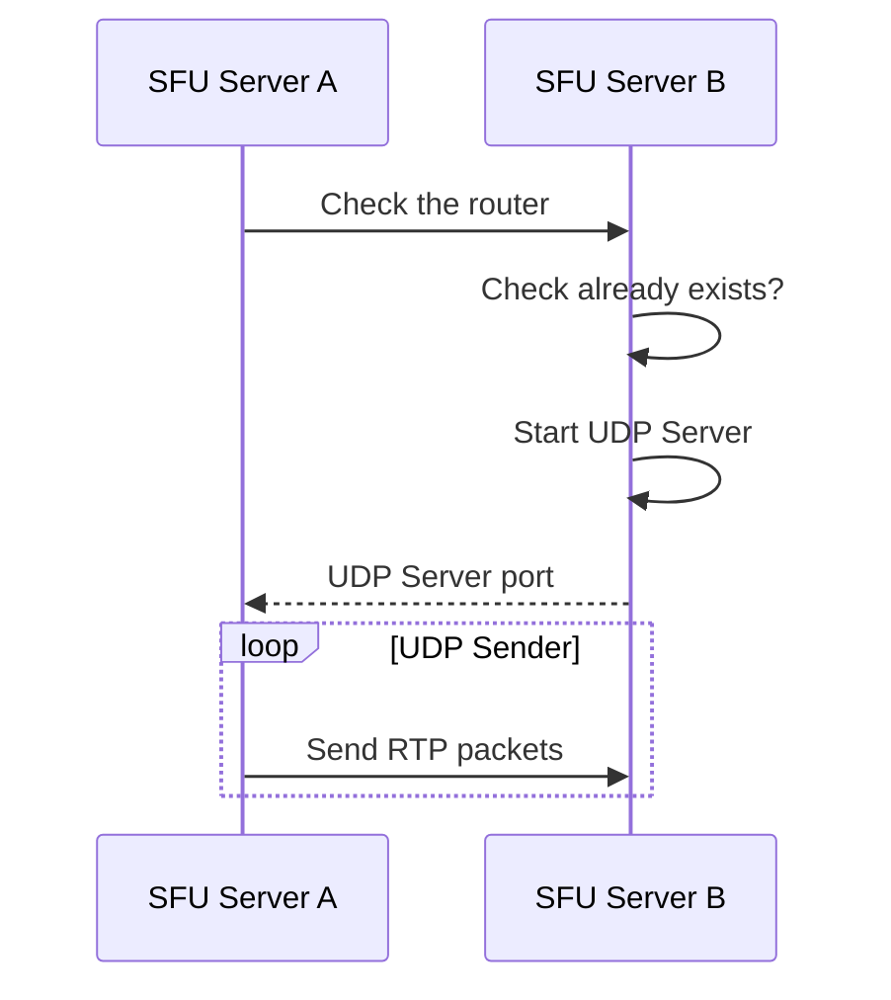

Rheomesh introduces a unique approach to load balancing called "Relay" - a method for distributing load across SFU servers within the same subnet.

# Why Relay is needed
Traditional SFU servers face significant limitations when it comes to scaling and fault tolerance. An SFU server acts as just one peer in the WebRTC stack, which means the concept of splitting it into multiple instances isn't natively supported. This creates two major challenges:

1. Performance bottleneck: Server performance is inherently limited by a single machine's specifications
Fault tolerance: Running multiple instances for redundancy is challenging without proper load distribution

2. Rheomesh's Relay feature solves these problems by enabling RTP packet forwarding between SFU servers, effectively creating a distributed SFU system.

# Basic usage
To use the Relay feature, call the [`relay_to`](https://docs.rs/rheomesh/latest/rheomesh/publisher/struct.Publisher.html#method.relay_to) method on a Publisher. You need to specify the target SFU server's:

1. IP address
1. Port (default: 9443, customizable via [`WorkerConfig`](https://docs.rs/rheomesh/latest/rheomesh/config/struct.WorkerConfig.html))
1. `router_id`

Important: Create a router on the target server first and use its ID as the router_id parameter.
Once the relay is established, you can subscribe to the publisher using the original publisher ID on the target server:

```rust
let (subscriber, offer) = subscribe_transport.subscribe(original_publisher_id).await.unwrap();
```

For complete usage examples, see the examples provided in the repository.


# How Relay works

Typically, RTP packets received from client `a` by server `A` can only be viewed by clients connected to server `A` (client `c`). The relay mechanism allows these packets to be forwarded to clients connected to server `B`, effectively enabling cross-server streaming.



## Mechanism

When you call [`relay_to`](https://docs.rs/rheomesh/latest/rheomesh/publisher/struct.Publisher.html#method.relay_to) method, Rheomesh establishes a UDP connection between the servers to forward RTP packets:




The process works as follows:

1. Server A verifies that the specified router exists on Server B
1. Server B starts a dedicated UDP server to receive RTP packets
1. Server B returns the UDP port to Server A
1. Server A begins forwarding RTP packets to Server B via UDP

# DataChannels support
The Relay feature isn't limited to media streams. DataChannels are also supported through the same mechanism. DataPublisher provides the same [`relay_to`](https://docs.rs/rheomesh/latest/rheomesh/data_publisher/struct.DataPublisher.html#method.relay_to) method with identical parameters, allowing you to relay data channels across servers just as easily as media streams.


# Network requirements
This feature is designed to work within the same subnet, where servers can communicate directly with each other without additional security considerations.
