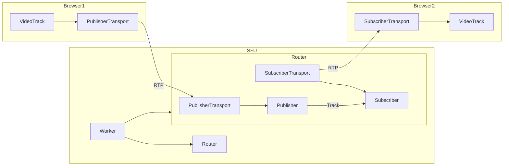

```mermaid
graph LR
subgraph SFU
    W[Worker] --> R1[Router]
    W --> R2[Router]
    subgraph R1[Router]
        PS1[PublisherTransport]
        P1[Publisher]
        PS1 --> P1
        SS2[SubscriberTransport]
        S1[Subscriber]
        SS2 --> S1
        P1 -->|Track| S1
    end
end
subgraph Browser1
    PC1[PublisherTransport]
    T1[VideoTrack]
    T1 --> PC1
end
subgraph Browser2
    SC2[SubscriberTransport]
    T2[VideoTrack]
    SC2 --> T2
end
PC1 -->|RTP| PS1
SS2 -->|RTP| SC2
```
